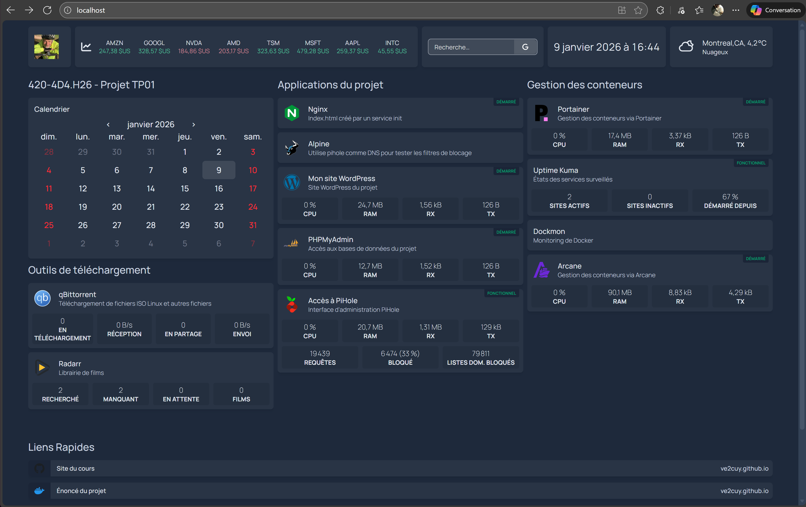
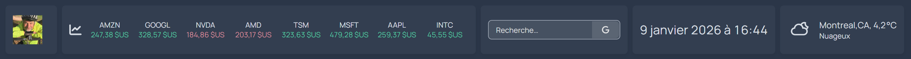
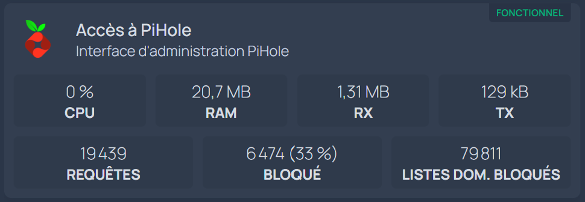
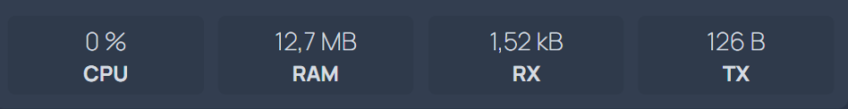
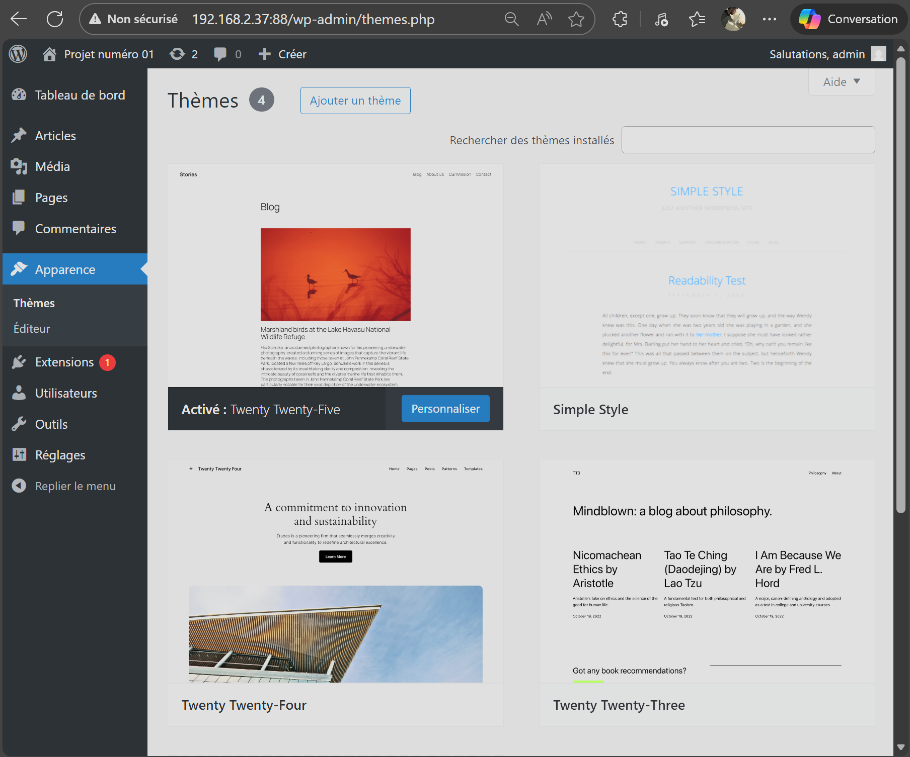
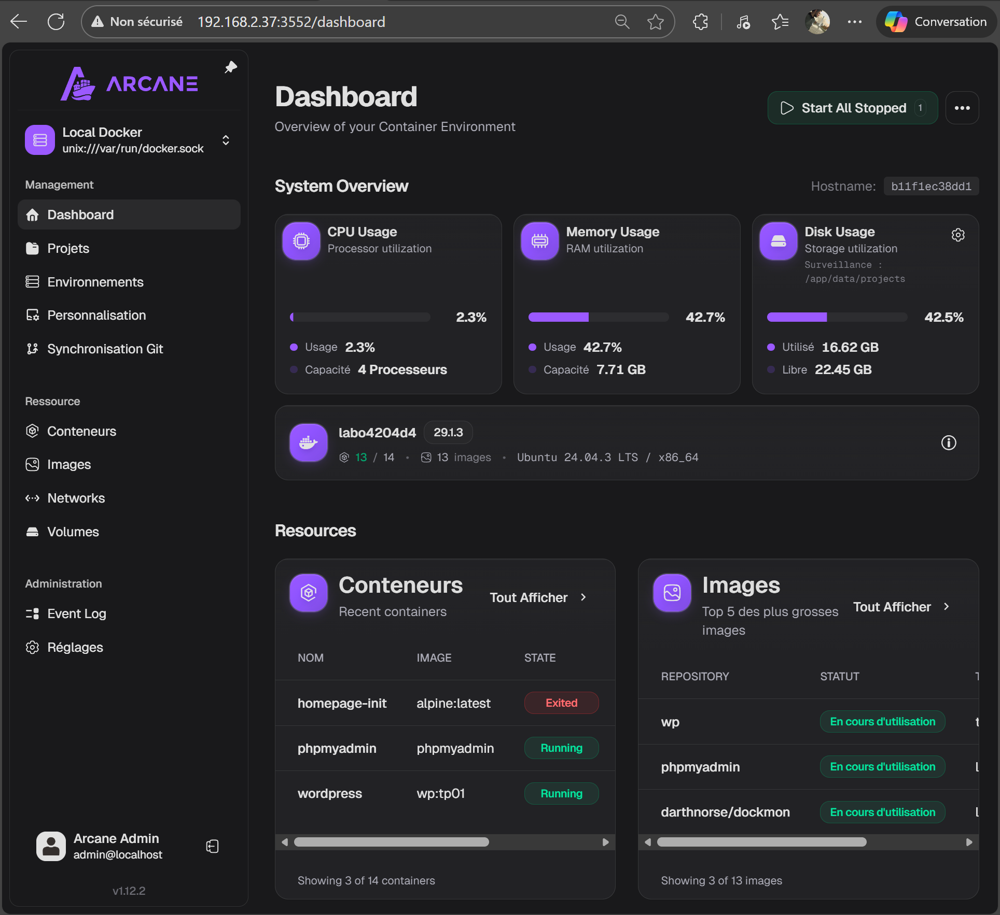
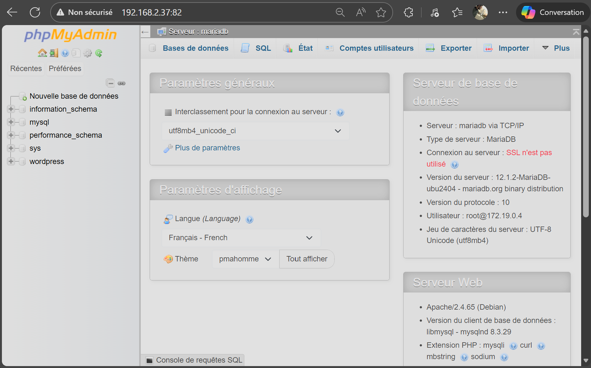
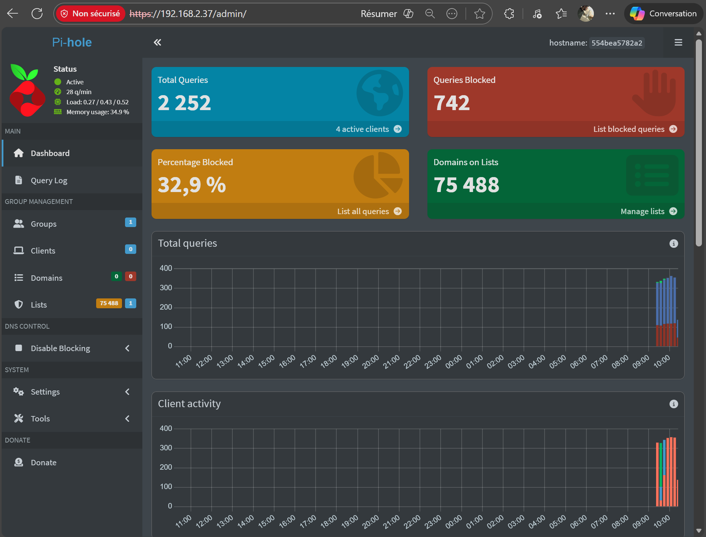
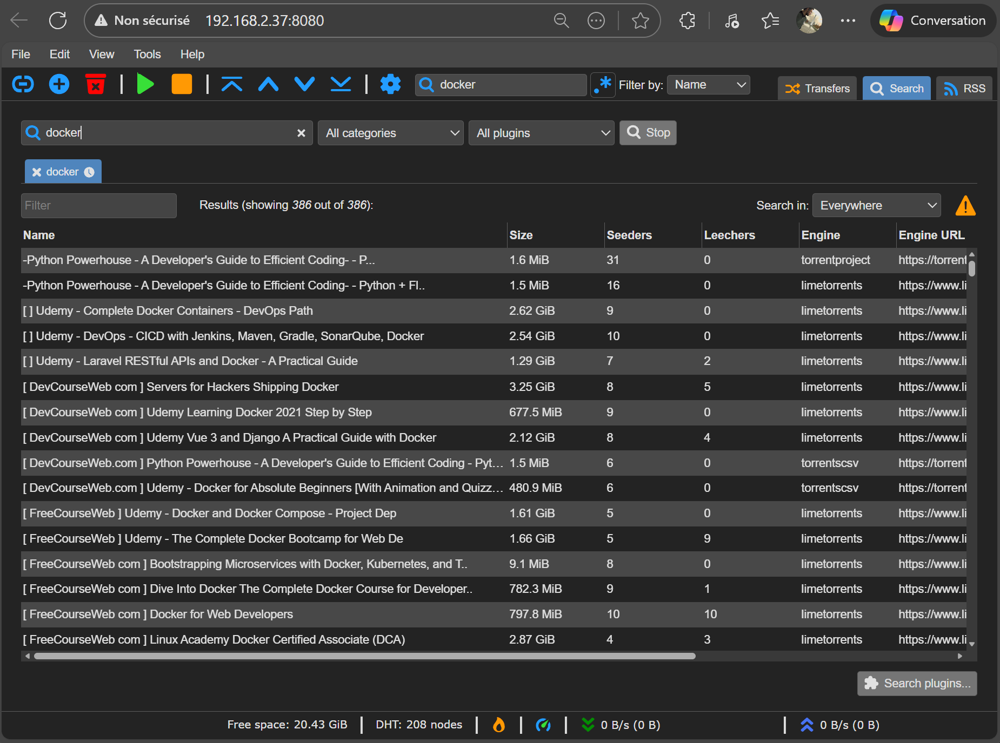
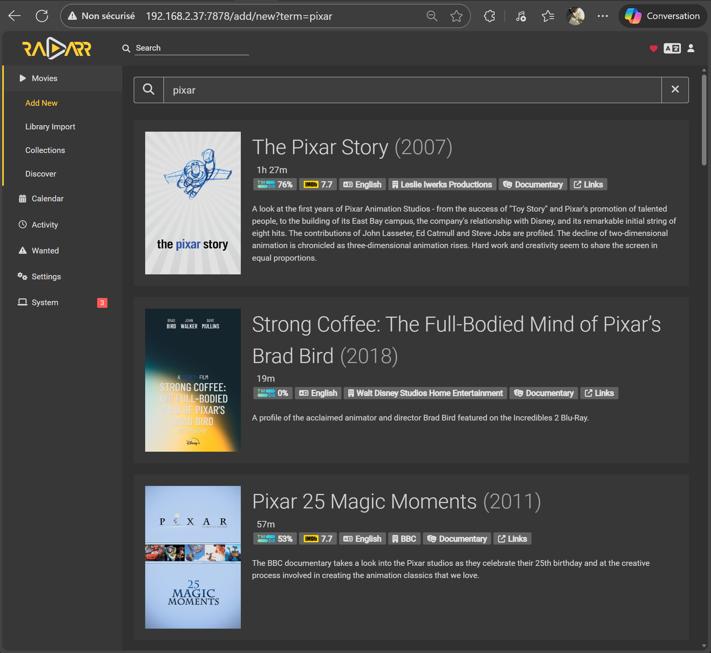

# 420-4D4 : Projet 01 - Version 2026 

### Déploiement d'un système de complexité moyenne via Docker.

<p align="center">
    
</p>


---

## 👉 Voici les directives de la réalisation du projet 

## 1 - Déployer, à partir d'images de conteneurs, les services (applications) suivants:

* Arcane
* Dockmon
* PhpMyAdmin
* Pihole
* Portainer
* qbitTorrent
* Radarr
* Uptime Kuma
* Wordpress
* Ngnix
* Alpine

---

## 2 - Rendre accessible, via l'application `Homepage`, les différents services, en proposant une mise en page tel que:

<p align="center">
    
</p>

👉 NOTE: Vous pouvez utiliser une mise en page différente.  Cependant, tous les éléments doivent-être présents.

---

### 2.1 - Voici le contenu requis sur Homepage

* Votre photo ou avatar en haut de l'écran.
* La valeur des actions de la bourse, stockées dans la variable `À définir`.
* Date et heure du jour.
* Température de la ville, par lat et long, renseignée par les variables: `METEO_VILLE`, `METEO_LONG` et `METEO_LAT`.



* 👉 Le calendrier du mois est optionnel.
* Les applications (services) du projet.  Voir point 1.
* Un lien vers votre dépôt `Docker hub`.
* Un lien vers le site de votre choix.

---

### 2.2 - API vers les services.

Plusieurs services, comme par exemple `Pihole`, propose une API qui peut être utilisée par `Homepage` pour afficher des informations sur le déroulement de l'application.

Dans l'exemple suivant, il est possible de suivre les statistiques de blocages de `Pihole` en temps réel via `Homepage`.



## Dans le projet, il faut utiliser l'API `Docker` pour les services suivants:

* Nginx
* Wordpress
* PHPMyAdmin
* Portainer
* Arcane
* Pihole (💡déjà fait dans le projet de départ)

👉 NOTE: L'API Docker affiche la zone suivante:




## Et l'API spécifique aux applications suivantes:

* Pihole (💡déjà fait dans le projet de départ)
* qBitTorrent
* Radarr
* Uptime Kuma (défi supplémentaire, voir la docum sur Homepage)

👉 NOTE: L'API PiHole affiche la zone suivante:


---

## 3 - Ce dépôt contient les fichiers de départ.

👉 IMPORTANT: Il faut utiliser la structure proposée par le projet de départ.  Il ne faut pas renommer ou déplacer les fichiers.

Chacun des services doit-être renseigné dans le fichier YAML portant son nom.

Le fichier `docker-compose.yml` contient des directives pour inclure les fichiers de services.

```yaml
include:
- ./services/init-dashboard.yml
- ./services/arcane.yml
- ./services/uptime-kuma.yml
...
```

💡NOTE: Le projet de départ est fonctionnel et propose déjà les services `Alpine` et `Pihole` via `Homepage`.

---

## 3 - Le fichier `.env`

Le fichier `.env`, fournit avec le projet de départ, contient les variables d'environnement qui devront être utilisées pour renseigner certaines clés des services et de Homepage.

Par exemple,

```yaml
# Extrait de .env
HOST_IP=192.168.2.37
DNS_IP=172.30.0.53
---

# Le DNS utilisé par Alpine:
services:
  alpine:
    dns:
      -  ${DNS_IP:-0.0.0.0}   
---

# L'item pihole dans Homepage:
- Accès à PiHole:
    icon: pi-hole.png
    href: https://${HOST_IP}/admin
```

👉 Il faudra renseigner `HOST_IP` en fonction de votre environnement de développement.


**💡IMPORTANT** -> TOUS les `ports` exposés des services doivent-être renseignés par une variables du fichiers `.env`. Il faut être en mesure de pouvoir changer les `ports`, ainsi que l'`adresse IP` du système, sans avoir à modifier les fichiers `yml` des services et de l'application `Homepage`.

🛑 Lors de la correction, un fichier `.env` différent sera utilisé.

---

## 4 - Les fichiers de configuration de `Homepage`

Les fichiers de configuration de l'application `Homepage` doivent être générés dynamiquement par programmation.

Pour ce faire, il faudra utiliser un service d'initialisation, utilisant le même volume que le service `Homepage`, pour créer les fichiers de l'application.

Un exemple est fourni avec le projet de départ, pour les services Pihole et Alpine, extrait du document de cours: [Introduction à Homepage](https://ve2cuy.github.io/4204d4/Documentation/Docker/homepage.html).

---

## 5 - Wordpress

Le service `Wordpress` doit être lancé à partir d'une image personnalisée qui propose le thème [simple-style](https://wordpress.org/themes/simple-style/) et l'extension (plugin) [
EnlighterJS Syntax Highlighter](https://github.com/EnlighterJS). 

Par exemple, pour le thème:



<br/>

`Wordpress` utilise, comme dépendance, le SGBD `MariaDB`.  Les fichiers de MariaDB seront stockés dans le dossier `./volumes/bdwp`.


👉 NOTE: Les ressources pour construire (build) l'image de Wordpress seront placées dans le dossier `./wordpress`.

---

## 6 - Nginx

Le fichier `nginx.yml` doit contenir deux (2) services: `nginx` et `init-nginx`.

Le service `init-nginx` doit créer, par programmation, une page d'accueil web (index.html) avec le contenu de votre choix.

Le service `nginx` doit-être dépendant du succès du service `init-nginx`.

---

## 7 - Directives de la remise du projet

À déterminer ...

---

## 8 - Grille de correction

À déterminer.

---

## 9 - Les écrans des applications

Voici ce qui est affiché lorsque nous suivons le lien vers l'application:


### 9.1 - Wordpress


### 9.2 - Arcane


### 9.3 - Dockmon


### 9.4 - PHPMyAdmin


### 9.5 - Pihole


### 9.6 - Portainer


### 9.7 - qbittorrent


### 9.8 - Radarr


### 9.10 - Nginx

Une page de votre choix, générée par le service init-nginx.

---

## La commande `docker compose up`, produit l'affichage suivant:

```bash
$ 4204D4-TP01-H26-solution> docker compose up -d

[+] Running 18/18
 ✔ Network reseauWP                                 Created
 ✔ Network homepage-network                         Created
 ✔ Network 4204d4-tp01-h26-solution_projet_network  Created
 ✔ Container nginx                                  Started
 ✔ Container radarr                                 Started
 ✔ Container uptimekuma                             Started
 ✔ Container qbittorrent                            Started
 ✔ Container mariabd                                Started
 ✔ Container homepage-init                          Exited 
 ✔ Container init-nginx                             Exited 
 ✔ Container pihole                                 Started
 ✔ Container dockmon                                Started
 ✔ Container portainer                              Started
 ✔ Container alpine                                 Started
 ✔ Container arcane                                 Started
 ✔ Container homepage                               Started
 ✔ Container phpmyadmin                             Started
 ✔ Container wordpress                              Started

$ docker ps
CONTAINER ID   IMAGE                                    COMMAND                  CREATED        STATUS                   PORTS                                              NAMES
7f8d85a25147   ghcr.io/gethomepage/homepage:latest      "docker-entrypoint.s…"   3 hours ago    Up 6 minutes (healthy)   0.0.0.0:80->3000/tcp,   [::]:80->3000/tcp          homepage
be091182c7e6   wp:tp01                                  "docker-entrypoint.s…"   3 hours ago    Up 6 minutes             0.0.0.0:88->80/tcp,     [::]:88->80/tcp            wordpress
e474a49b3e6f   phpmyadmin                               "/docker-entrypoint.…"   3 hours ago    Up 6 minutes             0.0.0.0:82->80/tcp,     [::]:82->80/tcp            phpmyadmin
700ad5515517   alpine                                   "sh -c ' while true;…"   3 hours ago    Up 6 minutes                                                                alpine
75d1ea103660   darthnorse/dockmon:latest                "/startup.sh"            3 hours ago    Up 6 minutes (healthy)   0.0.0.0:8001->443/tcp,  [::]:8001->443/            dockmon
6c6fe99c732c   pihole/pihole:latest                     "start.sh"               3 hours ago    Up 6 minutes (healthy)   0.0.0.0:443->443/tcp,   [::]:443->443/tcp,         pihole
ad02c020dc17   louislam/uptime-kuma:latest              "/usr/bin/dumb-init …"   3 hours ago    Up 6 minutes (healthy)   0.0.0.0:3001->3001/tcp, [::]:3001->3001/           uptimekuma
d6a2a5f1171e   ghcr.io/hotio/radarr                     "/init"                  3 hours ago    Up 6 minutes             0.0.0.0:7878->7878/tcp, [::]:7878->7878/           radarr
64709d1b01fb   portainer/portainer-ce:latest            "/portainer"             3 hours ago    Up 6 minutes             0.0.0.0:9000->9000/tcp, [::]:9000->9000/tcp, ...   portainer
f8415b35bed7   mariadb:latest                           "docker-entrypoint.s…"   3 hours ago    Up 6 minutes             3306/tcp                                           mariabd
edaa91d99561   lscr.io/linuxserver/qbittorrent:latest   "/init"                  3 hours ago    Up 6 minutes             0.0.0.0:6881->6881/tcp, [::]:6881->6881/tcp, ...   qbittorrent
5aef2ec20aab   ghcr.io/getarcaneapp/arcane:latest       "./arcane"               3 hours ago    Up 6 minutes             0.0.0.0:3552->3552/tcp, [::]:3552->3552/           arcane
5be5fd3defa0   nginx:latest                             "/docker-entrypoint.…"   3 hours ago    Up 6 minutes             0.0.0.0:100->80/tcp,    [::]:100->80/              nginx
```

---

## 10 - Vidéo de démonstration du système

À suivre ...


---

## Crédits

*Document rédigé par Alain Boudreault, aka ve2cuy, © 2026*  
*Version 2026.01.11.1*  